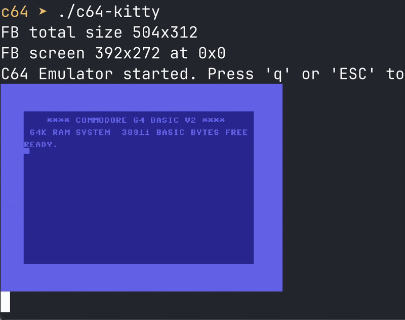

This is a port of the C64 emulator by Andre Weissflog [here](https://github.com/floooh/chips) that runs directly inside the terminal, using the Kitty termial graphics protocol, supported by the [Ghostty](https://ghostty.org/) and the [Kitty](https://sw.kovidgoyal.net/kitty/) terminals.

The code is licensed under the BSD license.

**This is just an example** with many limitations:

* The keys mapping is totally not implemented. Key strokes are sent to the emualtor like they are received, without the required translations. Use uppercase letters to write to teh BASIC interpreter.
* No sound.

## Building

If you want to compile without audio support, use:

    make

If you are in MacOS, use the following to use the low level C Audio API provided by the operating system. No additional libraries needed.

    make macos

On Linux and other systems with ALSA audio, use:

    make  linux-alsa

On Linux, to use `pulseaudio`, via the `pulseaudio-dev` library, use:

    make linux-pulseaudio

pulseaudio interface is very common on Linux and also work for newer distributions with PipeWire.

## Loading PRG / BIN files

You can load PRG programs passing them as first argument. They will be loaded in RAM after 4 seconds, then you should issue `RUN` or the `SYS` call with the right address (displayed by the emulator upon loading) in order to run the program.

For instance, try this:

    ./c64-kitty a_mind_is_born.prng

The *unbelievable* [demo by Linus Åkesson](https://linusakesson.net/scene/a-mind-is-born/), released under the license Creative Commons BY-NC-SA, so I hope it is fine to include it here since this is open source code (Otherwise, please, Linus, tell me!).

It is highly recommended to run the demo with audio on (on Mac and Linux).

## Credits

* C64 chips implementations by Andre Weissflog
* Emulation glue code, Kitty support and MacOS audio by Salvatore Sanfilippo
* Linux ALSA audio support by Pasquale 'sid' Fiorillo.
* Linux Pulse audio support by Luca Di Maio.
